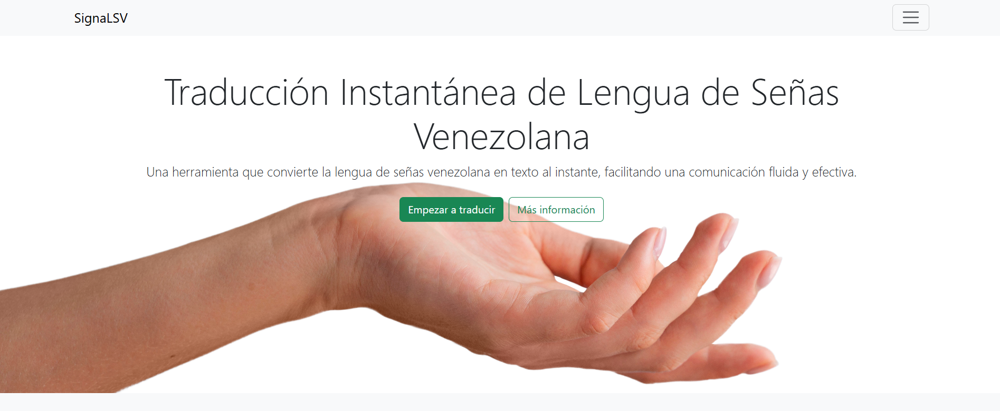
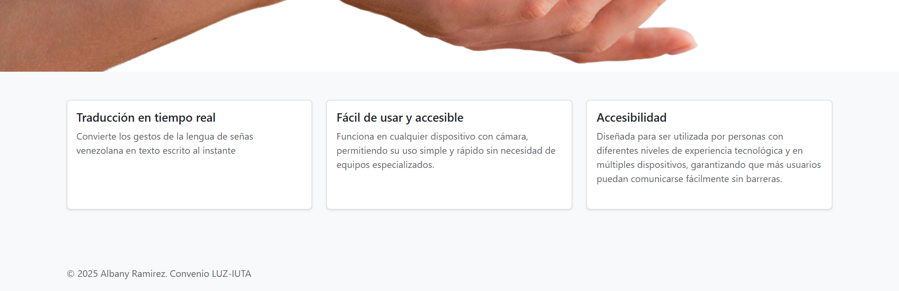
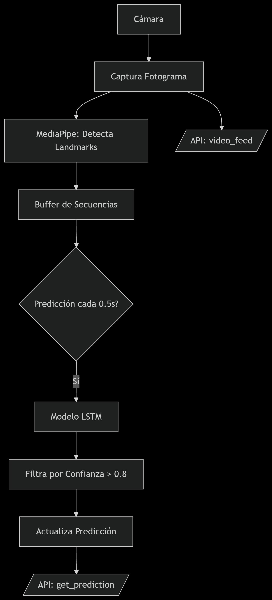

# Venezuelan Sign Language Translator to Text

>Parte del proyecto titulado "Traductor neuronal de lengua de señas venezolana a texto en tiempo real"

Este proyecto es un traductor de Lengua de Señas Venezolana (LSV) a texto, diseñado para facilitar la comunicación entre personas que usan LSV y personas que no la conocen. A través de una interfaz amigable e intuitiva, convierte automáticamente los signos en texto escrito, haciendo el proceso accesible y fácil de usar.

## Tabla de contenido

* [Descripción](#descripción)  
* [Características principales](#características-principales)  
* [Demo](#demo)  
* [Screenshots](#screenshots)  
* [Tecnologías y herramientas](#tecnologías-y-herramientas)  
* [Instalación](#instalación)  
* [Uso](#uso)  
* [Proceso](#proceso)  
* [Ejemplos de código](#ejemplos-de-código)  
* [Rendimiento del modelo](#Rendimiento-del-modelo)

## Descripción

El traductor toma gestos o señales de la Lengua de Señas Venezolana y los convierte en texto en tiempo real o casi real, con el fin de promover la inclusión y accesibilidad para personas con dificultades auditivas.

Este sistema puede ser de gran utilidad en contextos educativos, laborales, o sociales para mejorar la interacción y comprensión entre usuarios de LSV y personas que no conocen la lengua de señas.

## Características principales

El modelo logró predecir 30 caracteres de la LSV con una precisión de predicción >85%.

Funciones que se pueden añadir:

- Implementar el proyecto en la nube y crear una API para su uso.
- Ampliar el vocabulario del modelo.
- Incorporar un mecanismo de retroalimentación para que el modelo sea más robusto.

## Demo

aqui van las imagenes o gifs del demo 

## Screenshots





## Tecnologías y herramientas

- Python
- Flask 
- tensorflow
- Keras
- sklearn
- mediapipe
- OpenCV
- Angular

## Instalación

1. Clona este repositorio en tu máquina local:
   ```bash  
   git clone https://github.com/alezly/Venezuelan-Sign-Language-Translator-to-Text.git  
   ```
2. Navega al directorio del proyecto:
   ```bash
   cd Venezuelan-Sign-Language-Translator-to-Text
   ```
3. Frontend (Angular):
    ```bash
    npm install
    ```

4. Backend (Flask - API):
    ```bash
    cd api
    ```
  Crea un entorno virtual (recomendado)
    ```bash
    python -m venv venv
    ```
  Actívalo (Linux/Mac)
    ```bash
    source venv/bin/activate
    ```
  O en Windows
    ```bash
    venv\Scripts\activate
    ```
  Instala las dependencias de Python
    ```bash
    pip install -r requirements.txt
    ```

## Uso

### Frontend (Angular)

Inicia el servidor de desarrollo:

  ```bash
  ng serve
  ```

Abra el navegador en `http://localhost:4200/`.

### Backend (Flask)

Desde la carpeta `api`, ejecuta:

  ```bash
  python app.py
  ```

El servidor Flask estará disponible en `http://localhost:5000/`.

## Proceso

* Ejecuta `python captura_dataset.py` para capturar y almacenar las secuencias de gestos de la LSV utilizando la cámara del dispositivo. Los datos se guardan como coordenadas 3D de los puntos clave de las manos (landmarks) detectados por **MediaPipe Hands**.

* Se crea una estructura de carpetas en `data_sign_language/` para almacenar los datos (ej: `data_sign_language/a/0/`, donde `a` es la seña y `0` es el número de secuencia).

* La cámara se inicia y muestra una ventana con instrucciones en tiempo real.

* Las coordenadas (x, y, z) de los landmarks de las manos, extraídas con MediaPipe, se almacenan en archivos `.npy` organizados en carpetas según la seña y la secuencia.

* Ejecuta `python entrenamiento_modelo.py` para entrenar un modelo de red neuronal LSTM bidireccional que clasifica gestos de la LSV a partir de los datos capturados en `captura_dataset.py`. El modelo predice la seña correspondiente a una secuencia de landmarks de manos.

* El script lee los archivos .npy del dataset y los convierte en arrays de NumPy, luego, divide los datos en conjuntos de entrenamiento (80%) y prueba (20%).

* Se construye un modelo LSTM bidireccional con capas de Dropout para regularización.

* Se exporta el modelo entrenado como `modelo_lenguaje_senas.h5`.

* **Nota**: Modifica `ACTIONS` en el código para añadir más señas (debe coincidir con las carpetas en `data_sign_language/`).

* Ejecuta `main.py` para enviar video y predicciones al frontend desarrollado en **Angular** mediante la API creada con Flask, la cual tiene disponible dos endpoints: 
  * `/video_feed`: Transmisión de video en tiempo real con landmarks dibujados.
  * `/get_prediction`: Devuelve la última predicción en formato JSON.

### Diagrama de Flujo del proceso

graph TD
    A[Cámara] --> B[Captura Fotograma]
    B --> C[MediaPipe: Detecta Landmarks]
    C --> D[Buffer de Secuencias]
    D --> E{Predicción cada 0.5s?}
    E -->|Sí| F[Modelo LSTM]
    F --> G[Filtra por Confianza > 0.8]
    G --> H[Actualiza Predicción]
    H --> I[/API: get_prediction/]
    B --> J[/API: video_feed/]





## Ejemplos de código

```
# Entrenamiento del modelo de red neuronal LSTM bidireccional

import numpy as np
import os
from sklearn.model_selection import train_test_split
from tensorflow.keras.utils import to_categorical
from tensorflow.keras.models import Sequential
from tensorflow.keras.layers import LSTM, Dense, Dropout, Bidirectional
from tensorflow.keras.callbacks import TensorBoard, EarlyStopping, ReduceLROnPlateau
from sklearn.metrics import multilabel_confusion_matrix, accuracy_score
import matplotlib.pyplot as plt
import seaborn as sns

DATA_DIR = 'data_sign_language'
ACTIONS = ['a', 'b', 'c']
NO_SEQUENCES = 10
SEQUENCE_LENGTH = 30
# Número de características por fotograma (21 keypoints * 3 coordenadas x,y,z)
NUM_FEATURES = 21 * 3

# Carga del Dataset
print("Cargando el dataset...")
sequences, labels = [], []
for action_idx, action in enumerate(ACTIONS):
    for sequence_idx in range(NO_SEQUENCES):
        window = []
        for frame_num in range(SEQUENCE_LENGTH):
            try:
                # Carga del archivo .npy para cada fotograma
                res = np.load(os.path.join(DATA_DIR, action, str(sequence_idx), f"{frame_num}.npy"))
                # se asegura de que el array tenga la forma correcta
                if res.shape[0] != NUM_FEATURES:
                    print(f"Advertencia: Archivo {os.path.join(DATA_DIR, action, str(sequence_idx), f'{frame_num}.npy')} tiene forma {res.shape}, se esperaba {NUM_FEATURES}. Rellenando/truncando.")
                    # Rellena con ceros o trunca si el tamaño no coincide
                    if res.shape[0] < NUM_FEATURES:
                        res = np.pad(res, (0, NUM_FEATURES - res.shape[0]), 'constant')
                    else:
                        res = res[:NUM_FEATURES]

                window.append(res)
            except FileNotFoundError:
                print(f"Advertencia: Archivo no encontrado {os.path.join(DATA_DIR, action, str(sequence_idx), f'{frame_num}.npy')}. Saltando o rellenando con ceros.")
                window.append(np.zeros(NUM_FEATURES)) # Rellena con ceros si falta un archivo
        sequences.append(window)
        labels.append(action_idx)

# Convertir a arrays de NumPy
X = np.array(sequences)
y = to_categorical(np.array(labels)).astype(int)

print(f"Forma de X (secuencias): {X.shape}")
print(f"Forma de y (etiquetas): {y.shape}")
print("Dataset cargado.")

# Dividir el Dataset
X_train, X_test, y_train, y_test = train_test_split(X, y, test_size=0.20, random_state=42)
print(f"Tamaño del conjunto de entrenamiento: {X_train.shape[0]} muestras")
print(f"Tamaño del conjunto de prueba: {X_test.shape[0]} muestras")

# Construye el Modelo LSTM

model = Sequential()
model.add(Bidirectional(LSTM(128, return_sequences=True, activation='relu'), input_shape=(SEQUENCE_LENGTH, NUM_FEATURES)))
model.add(Dropout(0.2))
model.add(Bidirectional(LSTM(256, return_sequences=False, activation='relu')))
model.add(Dropout(0.2))
model.add(Dense(128, activation='relu'))
model.add(Dropout(0.3))
model.add(Dense(len(ACTIONS), activation='softmax'))

print("\nModelo construido:")
model.summary()

# Compilar el Modelo
model.compile(optimizer='Adam', loss='categorical_crossentropy', metrics=['accuracy'])

# Entrenamiento
log_dir = os.path.join('Logs')
tb_callback = TensorBoard(log_dir=log_dir)

# Early Stopping para detener el entrenamiento si la validación no mejora
early_stopping = EarlyStopping(monitor='val_loss', patience=20, restore_best_weights=True)

# Reduce learning rate cuando la métrica no mejora
reduce_lr = ReduceLROnPlateau(monitor='val_loss', factor=0.5, patience=10, min_lr=0.00001)

print("\nEntrenando el modelo...")
history = model.fit(X_train, y_train,
                    epochs=500,
                    batch_size=32,
                    validation_data=(X_test, y_test),
                    callbacks=[tb_callback, early_stopping, reduce_lr])

print("\nEntrenamiento finalizado.")
```

## Rendimiento del modelo 

aqui se van a mostrar las métricas como precisión, pérdida y matrices de confusión.

y gráficos de evolución del entrenamiento.
